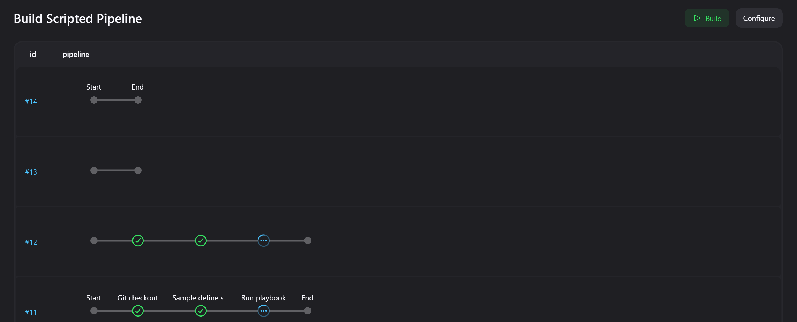

# Домашнее задание к занятию 10 «Jenkins»

## Подготовка к выполнению

Пришлось переписывать роль для Ubuntu 22.04

Для выполнения задания был использован Jenkins 2.479.2

CentOS совсем стал плох. Вроде всё развернул, java обновил, но с питоном беда

## Основная часть

1. Добавление Freestyle Job, который будет запускать `molecule test` из репозитория с ролью Vector.

Добавление репозитория (credentials для гита добавил но не заскриншотил)

Выбор нужной ветки

Какие команды будут выполняться

Тест прошел успешно

Конечно-же, с первого раза ничего не получилось. С 15 попытки всё прошло успешно.

2. Добавление Declarative Pipeline Job, который будет запускать `molecule test` из репозитория с ролью Vector.

Добавление репозитория 

Путь до скрипта

Выполнение в процессе

Результаты

3. Declarative Pipeline в репозитории в файле `Jenkinsfile`.

[Файл Declarative Pipeline](Jenkinsfile)

4. Создать Multibranch Pipeline.

Было немного непонятно, но полагаю что выполнение одновременно нескольких пайплайнов это и есть мультибранч пайплайн. у меня получилось вот так:

5. Создать Scripted Pipeline.

Создание

Выполнение пайплайна и консоль

Результат

Скрипт для Multibranch Pipeline пришлось переделать под свою репу в github и выполнить molecule test, поскольку для предложеной репы в файле нужен был ssh-key...

[Скрипт для Multibranch Pipeline](ScriptedJenkinsfile)

[Репозиторий, который был взят для пайплайна](https://github.com/gaidarvu/ansible-netology/tree/hw-ansible-05)

[Репозиторий, в котором лежит переделанная роль для jenkins и скрипты для пайплайнов](https://github.com/gaidarvu/jenkins-netology)